<div align="left">

# Siphon Protocol

> **Trade in the Shadows, Verify in the Light**
> 
> The first truly private DEX where users can see their balances but not others' - powered by Multi-Party Computation on Solana.

[](https://nextjs.org/)
[](https://www.typescriptlang.org/)
[](https://solana.com/)
[](https://arcium.com/)
[](LICENSE)

[🚀 Live Demo](https://siphon.money) | [🐦 Twitter](https://x.com/SiphonMoney)

</div>

---

## 🚀 What Makes This Special?

Traditional DEXs are **completely transparent** - everyone sees your balances, orders, and trading patterns. Privacy solutions like Tornado Cash are **completely opaque** - you can't even see your own balance without trial-and-error.

**We solved both problems.**

### The Innovation: User-Decryptable Encrypted Balances


**You** can decrypt your balance. **MPC** can validate operations. **Nobody else** can see anything.


## 🎯 User Journeys

### Journey 1: First-Time Deposit

```mermaid
sequenceDiagram
    actor User
    participant Frontend
    participant Wallet
    participant Solana
    participant MPC
    participant Backend
    
    User->>Frontend: Click "Deposit 100 SOL"
    Frontend->>Wallet: Request signature
    Wallet->>User: Approve transaction?
    User->>Wallet: ✅ Approve
    Wallet->>Solana: deposit_to_ledger(100)
    
    Note over Solana: SPL Transfer: User → Vault
    
    Solana->>MPC: Queue: update_ledger_deposit
    MPC->>MPC: Decrypt balance: 0<br/>Add: 0 + 100 = 100<br/>Re-encrypt with new nonce
    MPC->>Solana: Callback with Enc<Shared, 100>
    
    Note over Solana: Update UserPrivateLedger<br/>Emit UserLedgerDepositedEvent
    
    Solana->>Backend: Event: { user, nonce, encrypted_balances }
    Backend->>Frontend: WebSocket: DepositEvent
    
    Frontend->>Frontend: x25519.decrypt(encrypted_balances)
    Frontend->>User: 🎉 Balance: 100 SOL
```



**Time to completion:** ~5-10 seconds (MPC computation + finalization)

---

### Journey 2: Withdrawal (Two-Step Process)


**Why two steps?**
1. **Step 1 (MPC)**: Validate balance cryptographically → Lock funds in encrypted state
2. **Step 2 (Cranker)**: Execute actual token transfer after validation

This prevents **unauthorized withdrawals** even if an attacker compromises the cranker bot.

---

### Journey 3: Order Submission (Future)

```mermaid
sequenceDiagram
    actor Trader
    participant Frontend
    participant Solana
    participant MPC
    participant Backend
    
    Trader->>Frontend: Place order: Buy 10 SOL @ 105 USDC
    Frontend->>Frontend: Encrypt: x25519(price=105, qty=10)
    Frontend->>Solana: submit_order(encrypted_order)
    
    Solana->>MPC: Queue: add to orderbook
    MPC->>MPC: Decrypt orderbook<br/>Insert order (encrypted)<br/>Re-encrypt entire book
    MPC->>Solana: Callback: Enc<Mxe, NewOrderBook>
    
    Note over Solana: OrderBook updated<br/>Emit OrderProcessedEvent<br/>{ order_id, status: "pending" }
    
    Solana->>Backend: Event: OrderProcessed
    Backend->>Frontend: WebSocket: OrderAccepted
    Frontend->>Trader: ✅ Order #42 placed!
    
    Note over Trader: Trader CANNOT see:<br/>• Other orders<br/>• Liquidity depth<br/>• Market spread<br/><br/>Only MPC sees full orderbook
```




---

## 📈 Monitoring & Observability

### Key Metrics

**Frontend:**
- Balance decryption time (should be <100ms)
- WebSocket reconnection rate
- Transaction success rate
- User session duration

**Backend:**
- Event processing latency (indexer)
- Database query performance
- WebSocket connection count
- API response times

**Cranker:**
- Withdrawal execution success rate
- Average execution time (Step 1 → Step 2)
- Failed withdrawal count
- SOL balance (for transaction fees)

### Grafana Dashboard

```yaml
# Example metrics
- name: withdrawal_latency
  query: histogram_quantile(0.95, rate(withdrawal_duration_seconds_bucket[5m]))
  
- name: indexer_lag
  query: time() - max(last_indexed_block_timestamp)
  
- name: cranker_balance
  query: cranker_bot_sol_balance
  alert_threshold: 5  # Alert if < 5 SOL
```

---

## 🎓 Technical Challenges Solved

### 1. Large Encrypted Data Problem
**Challenge:** OrderBook encryption produces 1,344 bytes, exceeding Solana callback limits

**Solution:** Callback server pattern (future implementation)
- MPC posts large encrypted data to off-chain server
- Callback only contains reference hash
- Frontend fetches from callback server

### 2. User Balance Transparency
**Challenge:** Traditional privacy systems hide balances from users too

**Solution:** Dual-encryption scheme
- `Enc<Shared, Balances>` for user ledgers (user + MPC can decrypt)
- `Enc<Mxe, OrderBook>` for orderbook (only MPC can decrypt)

### 3. Withdrawal Security
**Challenge:** How to prevent unauthorized withdrawals while maintaining privacy?

**Solution:** Two-step verification
- Step 1: MPC validates on encrypted data
- Step 2: Cranker executes only after cryptographic proof

### 4. Real-Time Updates
**Challenge:** Solana events don't persist, how do users see history?

**Solution:** Event indexer architecture
- Backend listens 24/7, stores all events
- PostgreSQL for queryable history
- WebSocket for real-time push
- REST API for historical queries

---

## 🔮 Roadmap

### Phase 1: MVP (Current)
- ✅ User-decryptable balance management
- ✅ Deposit flow
- ✅ Two-step withdrawal
- ✅ Event emission
- ✅ Frontend implementation
- ✅ Backend event indexer

### Phase 2: Trading
- ✅ Order submission UI
- [ ] Callback server for large encrypted data
- ✅ Order matching engine
- [ ] Settlement execution
- [ ] Order history / portfolio view

### Phase 3: Advanced Features
- [ ] Limit orders + order types
- [ ] Price charts (aggregated, no order-level data)
- [ ] Notifications (email/SMS for fills)

### Phase 4: Scale
- [ ] Multiple trading pairs
- [ ] Liquidity mining
- [ ] Governance token

---

## 💎 Why This Matters

**For Traders:**
- 🔒 **Privacy**: Trade without revealing your strategy
- 💰 **No MEV**: Orders invisible to bots and sandwich attacks
- 📊 **Transparency**: You always know your exact balance
- ⚡ **Speed**: Solana's 400ms finality

**For DeFi:**
- 🏗️ **Composability**: Can integrate with existing DeFi protocols
- 🌐 **Censorship Resistance**: No KYC, no geographical restrictions
- 🔐 **Self-Custody**: You always control your keys
- 🚀 **Innovation**: First truly private yet transparent DEX

**For the Ecosystem:**
- 🧪 **MPC Research**: Pushes boundaries of encrypted computation
- 📚 **Open Source**: Full code available for audit and learning
- 🛠️ **Developer Tools**: Reusable patterns for future privacy dApps
- 🌟 **Proof of Concept**: Shows what's possible with Arcium MPC

---

### Community
- Twitter: https://x.com/SiphonMoney

## ⚠️ Disclaimer

This is an **experimental prototype** built for educational and research purposes.

- ❌ **NOT audited** for production use
- ❌ **NOT financial advice**
- ❌ **USE AT YOUR OWN RISK**

Always test on devnet first. Never invest more than you can afford to lose.

---


<p align="center">
  <b>🌟 Siphon Protocol</b>
</p>

<p align="center">
  <i>"** Made with ❤️ for Colloseum Cypherpunk **"</i> 
</p>
